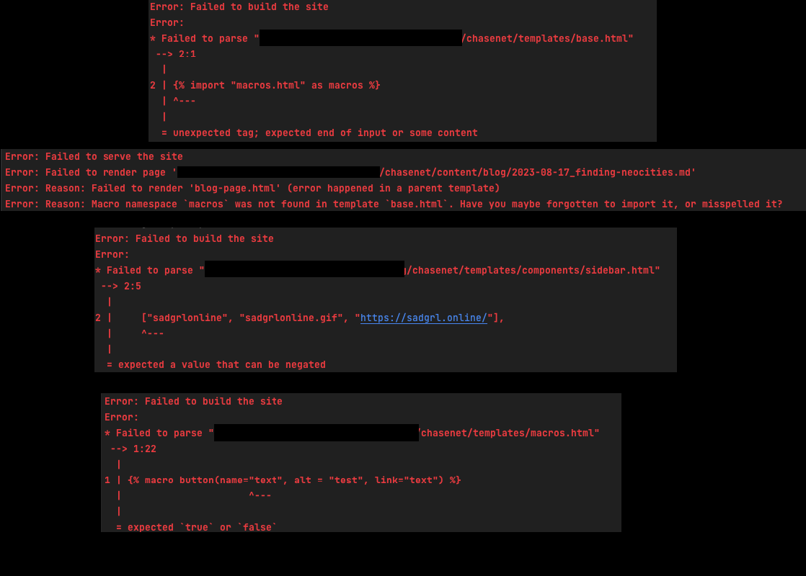

+++
title = "Restructuring And Learning"
authors = ["Chase"]
[taxonomies]
category=["website"]
tags=["web", "development", "zola"]
+++
Psyke! There's more to do!

Yes I called the website finished 4 days ago, but that was but a lie! Or at least I did what I said I'd do in that 
[post](@/about-website/2023-08-17_finishing-touches/index.md) and keep working on the website. So a few things I did an learned

## RSS Feed
Zola allows for easy integration of an rss feed. I did that now, so there's a feed available at [/rss.xml](/rss.xml)

I honestly don't use RSS (yet), and don't know how many people do, but it was easy to set up, and now it's there

## Restructuring
I love keeping my code somewhat clean and workable, main reason why I'm not writing all of this in pure html. 
So I moved some files around, extracted the comment box and extracted the visitor counter into a separate js file.

*Funfact:* Ublock will straight up block any js file called `pagestats.js`. So I renamed the file [viewcount.js](https://github.com/Chase22/chasenet/blob/3a6457852bebe81fcbe49cb6df3e1ed238cfa2d1/static/scripts/viewcount.js)

Zola (or Tera to be more precise) allows including other html files in your templates. These can be either on the same 
level as the template or in subdirectories. I made a components subdirectory for anything that isn't an actual web page, 
then I can include them like this:

```html
<div id="flex">
    
    <main>
        
        
    </main>

</div>

```
(The `` here is a placeholder for the actual page content. This is from the base template)

## Buttons
In the sidebar there's a list of buttons, these existed before but are now a bit extended. And I greatly changed how they are rendered.

For the people that don't know, there are called 88x31 buttons, due to their pixel size. 
They are commonly used to express interests, opinions, communities or link to other people. All the buttons on my website are linked to something.

Before I had this
```html
<div id="buttons">
    <a href="https://sadgrl.online/" target="_blank"></a>
    <a href="http://lu.tiny-universes.net/images-gfx/index.html" target="_blank"></a>
    <a href="https://anlucas.neocities.org/GifFiles" target="_blank"></a>
    <a href="https://yesterweb.org/no-to-web3/" target="_blank"></a>
</div>
```
(the get_url calls are zola functions to resolve the correct image paths)
Is it bad? No, it's pretty straight forward html. But for me, it was too chaotic. 
A lot of repeated code, things that I don't need to see like the html tags, targets etc. So I went down the amazing rabbit hole of ✨[tera macros](https://keats.github.io/tera/docs/#macros)✨

Macros allow you to build small functions that "return text", aka html. It's a way to have reusable template code build into your templates.

How that went?

I'd say it went okay

So I wanted to use that to clean up my buttons. So I build a quick little macro
```html

<a href="{{link}}" target="_blank"></a>



{{self::button(name=name, alt=name, link=link)}}

```

This macro needs to be included in the template. **Important** 
This needs to be the first line of the document. So it can't be any subtemplates and it can't even go below the 
filetype header. It doesn't actually tell you that, it just throws cryptic errors at you

```html

<!DOCTYPE html>
<html lang="en">
```
(Intellij absolute loves this. It will immediately scream at you for not having the !DOCTYPE as the first line)

So after a lot of fighting I actually got my buttons to look like this:

````html
    <div id="buttons">
        {{ macros::buttonNoAlt(name="sadgrlonline.gif", link="https://sadgrl.online/") }}
        {{ macros::button(name="fuck.png", alt="parental advice: I say 'fuck' a lot", link="http://lu.tiny-universes.net/images-gfx/index.html") }}
        {{ macros::button(name="wwwbutton.gif", alt="World wide Web, connecting people since 1991", link="https://anlucas.neocities.org/GifFiles") }}
        {{ macros::button(name="roly-saynotoweb3.gif", alt="Keep the web free, say no to web3", link="https://yesterweb.org/no-to-web3") }}
        {{ macros::button(name="site_not_rated.png", alt="web-rating: site is not yet rated", link="http://www.mabsland.com") }}
    </div>
````
Some would argue that this isn't even remotely better. Personally I like it better like that. Ideally 
I'd love to have a flat list of the buttons and their text somewhere and just generate the correct buttons, 
but I think I'll need some preprocessing for that. Sadly terra does not currently support nested arrays in templates

## noscript
I've seen that some people have a nojs button on their website and I took that as a mission to make my website work entirely without js. 
That doesn't mean I won't use js features (the view count is embedded with js). But I want the website to still be useable without js. 
Important features should not rely on js and things that does, should fall back gracefully. If anything doesn't work, 
please email me please email me about it at [chase@mailbox.org](mailto:chase@mailbox.org)

## Releases
I want to keep an archive of my websites changes, so I started creating [tags](https://github.com/Chase22/chasenet/tags) for major changes of the website. 
In the future I plan to render the index page of these snapshots and host them on the website as well