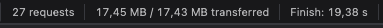
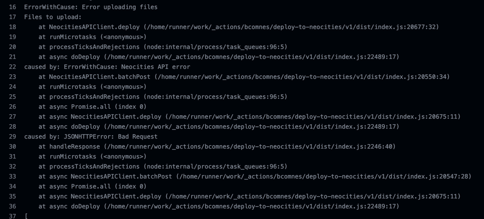
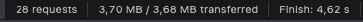

+++
title = "Image Processing"
authors = ["Chase"]
[taxonomies]
category=["website"]
tags=["web", "development"]
+++
As one might have noticed when loading my website. It's slow as fuck. Mostly thanks to two images. The background and the soon cat.

Yikes. Let's get this sorted.

## src-set
For those that don't know. Instead of giving an html img a src attribute, we can supply a srcset. 
Basically telling the browser a bunch of pictures and their size, so the browser can load the one closest to the required size. 
(Funfact: Nobody is stopping you from using entirely different pictures).

## Resizing everything
Now, one could resize these manually. But I'm more of a "over-automate things that really don't need to be automated" type of guy. So I did.

Wrote a [Kotlin Script](https://github.com/Chase22/chasenet/blob/ded2430e5f03509726f52cd705596d5bea5bdaf0/image-processing/ProcessImages.kts) that loads a bunch of image from one folder, resizes them to the factor 1.0, 0.75, 0.5 and 0.25 and throws them 
into an output with the required src-sets.

The result?

Ah, the pipeline breaks. No idea why, but neocities rejected my file uploading.

Uploading via the web ui and rerunning the pipeline worked. So. What is the result of that now?

Hey, that's pretty good. Not great. Still 3.4mb loading and my neocities is not at 14% storage, but it works i guess

## Next steps
So where to go from here?

I'll have to completely rework the image processing script. I want it to work with arbitrary factors and be 
a bit smarter about image resizing.

I also want to write a macro so I don't have to manually write blocks of src-sets everywhere into my website